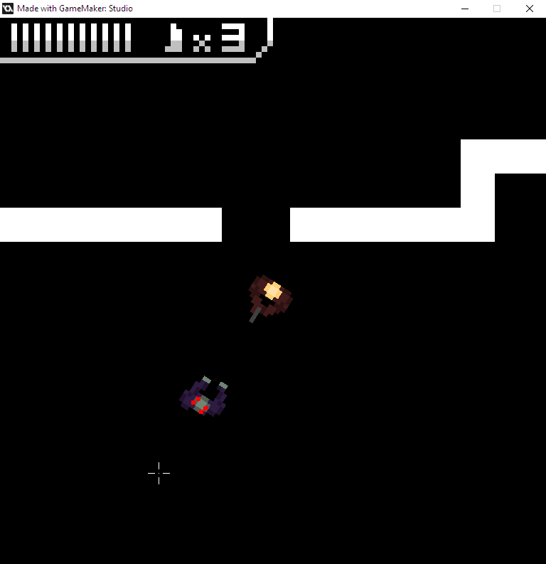

# Zombie Game
An unfinished project using GameMaker Studio 1.4

Unfortunately, this project was never finished and doesn't have many features (not even collision with the world).
However, it does have simple movement, in addition to shooting/reloading and zoom for the player.

I was planning to use free assets for graphics, but I stopped working on this project before I actually made use of them.

## Controls
Movement is WASD

Shooting is left-click

Zoom is right-click

Sprinting is shift; this moves in the direction of the camera

